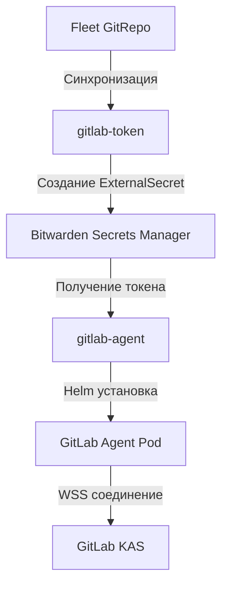

# GitLab Kubernetes Agent: Безопасная интеграция CI/CD с платформой

- [GitLab Kubernetes Agent: Безопасная интеграция CI/CD с платформой](#gitlab-kubernetes-agent-безопасная-интеграция-cicd-с-платформой)
  - [Зачем нужен этот компонент](#зачем-нужен-этот-компонент)
  - [Безопасность: принцип минимальных привилегий](#безопасность-принцип-минимальных-привилегий)
    - [1. Гранулярный RBAC](#1-гранулярный-rbac)
    - [2. Строгая сегрегация доступа](#2-строгая-сегрегация-доступа)
    - [3. Безопасное управление секретами](#3-безопасное-управление-секретами)
  - [Интеграция с инфраструктурой](#интеграция-с-инфраструктурой)
    - [1. Multi-кластерная поддержка](#1-multi-кластерная-поддержка)
    - [2. Отказоустойчивость и placement](#2-отказоустойчивость-и-placement)
    - [3. Мониторинг и observability](#3-мониторинг-и-observability)
  - [Процесс развертывания через Fleet](#процесс-развертывания-через-fleet)
  - [Рабочие примеры для разработчиков](#рабочие-примеры-для-разработчиков)
    - [1. Безопасное развертывание приложения](#1-безопасное-развертывание-приложения)
    - [2. Динамическое окружение для feature-ветки](#2-динамическое-окружение-для-feature-ветки)
    - [3. Проверка состояния перед релизом](#3-проверка-состояния-перед-релизом)
  - [Production-рекомендации](#production-рекомендации)

## Зачем нужен этот компонент

GitLab Kubernetes Agent предоставляет **безопасный двусторонний канал связи** между GitLab и Kubernetes-кластером, решая критические проблемы традиционного подхода:

- 🔒 **Устранение необходимости давать GitLab прямой доступ к kubeconfig** (традиционный подход требует предоставления кластерных прав GitLab runner'ам)
- 🚦 **Контролируемый RBAC** с минимальными необходимыми привилегиями для CI/CD пайплайнов
- 📡 **Pull-based модель** вместо push (агент сам опрашивает GitLab, а не наоборот), что идеально для сред с strict firewall policies
- 🔄 **Единый интерфейс для управления** через familiar GitOps workflow в GitLab UI
- 👥 **Разделение прав доступа** между операционными командами и разработчиками

**Ключевые сценарии использования:**

- Безопасное развертывание приложений через GitLab CI без предоставления cluster-admin прав
- Динамические окружения для feature-веток с автоматической очисткой
- Мониторинг состояния кластера непосредственно в GitLab UI
- Интеграция с Kubernetes API для custom CI/CD логики (проверка состояния подов перед релизом)

## Безопасность: принцип минимальных привилегий

### 1. Гранулярный RBAC

```yaml
# gitlab-agent/additional/sa.yaml
apiVersion: rbac.authorization.k8s.io/v1
kind: Role
rules:
  # Core API (только необходимые ресурсы)
  - apiGroups: [""]
    resources: ["pods", "services", "endpoints", "configmaps", "secrets"]
    verbs: ["get", "list", "watch", "create", "update", "patch", "delete"]

  # Workloads (полный доступ, но только в рамках namespace)
  - apiGroups: ["apps"]
    resources: ["deployments", "statefulsets", "daemonsets", "replicasets"]
    verbs: ["*"]

  # Prometheus Operator CRDs (для мониторинга приложений)
  - apiGroups: ["monitoring.coreos.com"]
    resources: ["servicemonitors", "podmonitors", "prometheusrules"]
    verbs: ["*"]

  # External Secrets и Gateway API (современная инфраструктура)
  - apiGroups: ["external-secrets.io"]
    resources: ["externalsecrets"]
    verbs: ["*"]
  - apiGroups: ["gateway.networking.k8s.io"]
    resources: ["httproutes"]
    verbs: ["*"]
```

### 2. Строгая сегрегация доступа

```yaml
# .gitlab/agents/k8s-gitlab-agent-01/config.yaml
ci_access:
  groups:
    - id: oit/k8s
    - id: oit/services

user_access:
  access_as:
    agent: {}
  groups:
    - id: oit/k8s
    - id: oit/services
```

- **Только группы `oit/k8s` и `oit/services`** имеют доступ к кластеру
- **Нет доступа к ClusterRoleBinding, StorageClass, Node** и другим критическим ресурсам
- **Отдельные права для CI и пользователей** через GitLab RBAC

### 3. Безопасное управление секретами

```yaml
# gitlab-token/helm/templates/external-secret.yaml
apiVersion: external-secrets.io/v1
kind: ExternalSecret
spec:
  secretStoreRef:
    name: bitwarden-secretsmanager
    kind: ClusterSecretStore
  target:
    name: agent-secret
    template:
      data:
        token: '{{ printf "{{ index . %q }}" .Values.clusterName }}'
  dataFrom:
    - extract:
        key: gitlab-agent-tokens
```

- Токены хранятся в **Bitwarden, а не в Git или ConfigMap**
- Динамическое формирование токена на основе имени кластера
- Автоматическая ротация при изменении в Bitwarden

## Интеграция с инфраструктурой

### 1. Multi-кластерная поддержка

```yaml
# fleet.yaml
targetCustomizations:
  - name: prod
    clusterSelector:
      matchLabels:
        okbtsp.corp/template: talos-vmware
```

- Единая точка управления для всех кластеров с меткой `talos-vmware`
- Автоматическое применение правильной конфигурации для каждого кластера
- Поддержка как development (rancher-k3s), так и production (talos-vmware) сред

### 2. Отказоустойчивость и placement

```yaml
# agent-values.yaml
tolerations:
  - key: "node-role.kubernetes.io/infra"
    operator: "Equal"
    value: ""
    effect: "NoSchedule"
affinity:
  nodeAffinity:
    requiredDuringSchedulingIgnoredDuringExecution:
      nodeSelectorTerms:
        - matchExpressions:
            - key: node-role.kubernetes.io/infra
              operator: In
              values: [""]
```

- Запуск **только на выделенных infra-нодах**
- Ресурсы строго ограничены (100m CPU, 128Mi RAM)
- Безопасный контекст выполнения (`runAsNonRoot: true`)

### 3. Мониторинг и observability

```yaml
serviceMonitor:
  enabled: true
```

- Автоматическое создание ServiceMonitor для Prometheus
- Интеграция с существующим стеком мониторинга
- Сбор метрик использования ресурсов агентом

## Процесс развертывания через Fleet



1. **Шаг 1:** Зависимости
   ```yaml
   dependsOn:
     - name: external-secrets
     - name: prom-operator
     - name: gitlab-token
   ```
2. **Шаг 2:** Безопасное получение токена
   - Создание ExternalSecret для токена агента
3. **Шаг 3:** Развертывание агента
   - Helm chart версии 2.21.0
   - Кастомные настройки RBAC
   - Настройка подключения к KAS

## Рабочие примеры для разработчиков

### 1. Безопасное развертывание приложения

```yaml
# .gitlab-ci.yml
deploy_to_production:
  stage: deploy
  image: registry.okbtsp.corp/oit/k8s-tools:latest
  script:
    - kubectl apply -f k8s/production-manifests/
  environment:
    name: production
  rules:
    - if: $CI_COMMIT_BRANCH == "main"
```

### 2. Динамическое окружение для feature-ветки

```yaml
# .gitlab-ci.yml
deploy_review:
  stage: deploy
  script:
    - kubectl apply -f k8s/review-manifests/ -n review-$CI_COMMIT_REF_SLUG
  environment:
    name: review/$CI_COMMIT_REF_NAME
    url: https://review-$CI_COMMIT_REF_SLUG.app.okbtsp.corp
    on_stop: stop_review
  rules:
    - if: $CI_COMMIT_BRANCH != "main"
```

### 3. Проверка состояния перед релизом

```yaml
# .gitlab-ci.yml
verify_deployment:
  stage: verify
  script:
    - kubectl wait --for=condition=available deployment/my-app --timeout=300s -n production
```

## Production-рекомендации

1. **Ротация токенов:**

   - Настройте автоматическую ротацию токенов в Bitwarden каждые 90 дней
   - Используйте push-механизм ExternalSecrets для сохранения новых токенов

2. **Аудит и логирование:**

   ```yaml
   # Добавьте в конфигурацию агента
   config:
     log_level: info
     log_format: json
   ```

   - Централизованный сбор логов через Loki
   - Аудит всех действий GitLab через Kubernetes audit logs

3. **Масштабирование:**

   - Для кластеров с > 50 активных пайплайнов увеличьте ресурсы до 500m CPU/512Mi RAM
   - Рассмотрите развертывание нескольких агентов с разными правами для разных команд

4. **Disaster Recovery:**

   - Храните резервные копии конфигурации агента в отдельном Git-репозитории
   - Настройте автоматическое восстановление через Fleet при потере кластера

5. **GitOps-паттерн:**
   ```yaml
   # Рекомендуемый workflow
   Feature Branch --> Merge Request --> Security Scan --> Auto-Deploy to Review --> Manual Approval --> Production
   ```

> **Важно:** GitLab Agent в этой архитектуре — это не замена Argo CD, а дополняющий инструмент для CI/CD пайплайнов. Argo CD управляет инфраструктурой и базовыми компонентами через Fleet, а GitLab Agent предоставляет разработчикам безопасный способ развертывания их приложений. Такое разделение четко разделяет зоны ответственности и минимизирует риски безопасности. Никогда не давайте агенту права на изменение инфраструктурных компонентов — только на управление приложениями в специально выделенных namespace.
